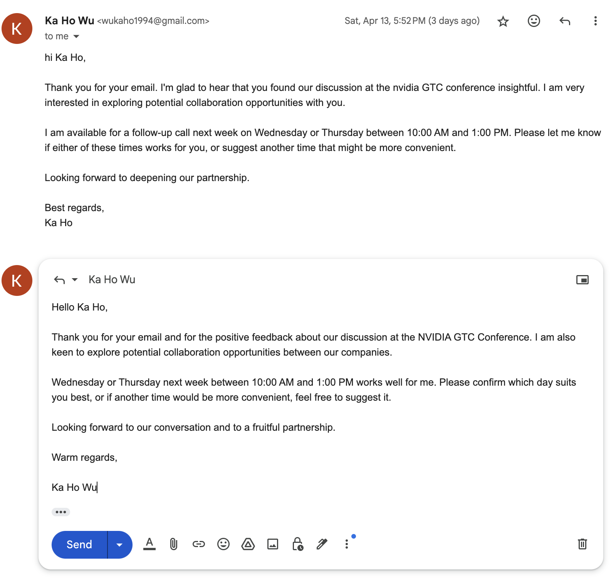

# UtopiaOS MemSearch

UtopiaOS MemSearch enhances your MacOS experience by providing a powerful capability to search through your own interaction history. It uses screen tracking and OCR technologies to record and analyze your screen, allowing you to retrieve information seamlessly from past activities.

## Installation
To install the necessary dependencies for UtopiaOS MemSearch, run the following command:

1. Clone the repository
2. Create a virtual environment:
```bash
python -m venv MemSearch
```

3. Activate the virtual environment (MacOS)
```bash
source MemSearch/bin/activate
```

4. Install the required packages:
```bash
pip install -r requirements.txt
```
Ensure you have Python installed on your system to use pip. It is also recommended to use a virtual environment to manage the dependencies.

## Usage
To start using UtopiaOS MemSearch, execute the included shell script:

```bash
chmod +x track.sh
./track.sh
```
This script initializes the system and starts all necessary services for tracking and searching your OS interaction history.

By default, we will search through the entire screen. If you want to search through active windows, provide argument for the search_app.py, by typing "active" in prompt. To start the MemSearch Python app, simply type:

```bash
chmod +x search.sh
./search.sh
```

To do analysis on your daily computer usage, run:
```bash
chmod +x analyze.sh
./analyze.sh
```


To search, just type in any keyword:


To do app search, please type in name of the app, follow by ": ", and then keyword. e.g. "Arc: No country for old man". 


To get suggestions to list of action you could do, command+shift on any window


To autocomplete any message window, command+shift on the input field.



## Components
UtopiaOS MemSearch consists of several Python scripts, each serving a unique role in the system:

1. screen_tracker.py: This script records your screen activity and performs OCR (Optical Character Recognition) to extract key textual information from the screen.

2. system_tracker.py: Tracks all open applications, marking each as active or dormant, thus providing a comprehensive view of your system's application usage over time.

3. search_app.py: A Python application with a simple GUI that allows you to search through your MacOS interaction history.

4. daily_summary.py: generate an AI report of user's usage today. User could proceed to ask questions about his daily routines. 

5. messaging_copilot.py: press command+shift on any chatting window (Gmail, iMessage, Telegram etc.), and watch AI auto generate response for you. 

6. suggest.py: suggest a list of actions user could do based on the current context. 
